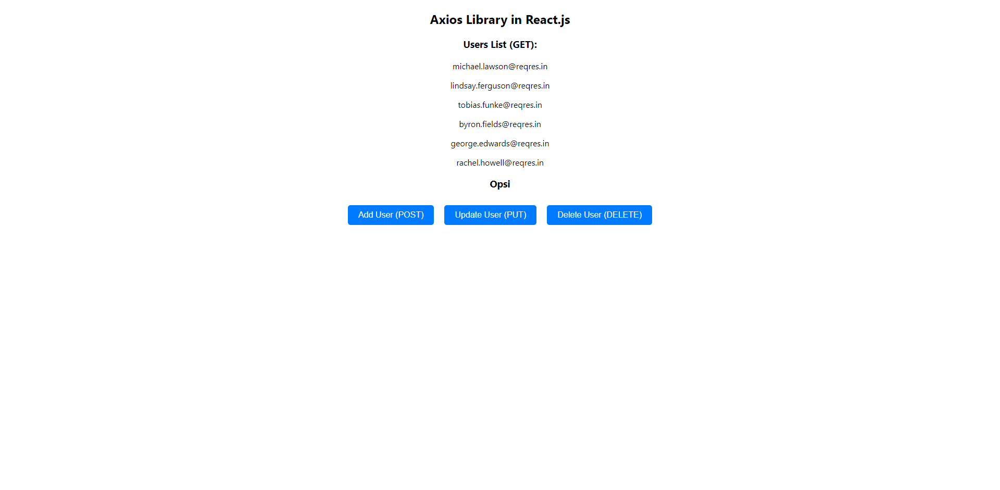

Nama: Garcia Bryan Farrel
NPM: 2327250026

API menyediakan cara standar untuk mengirim dan menerima data, serta memanfaatkan fungsi atau fitur yang disediakan oleh server

Cara Kerja API dan cara menggunakan
1. Jalankan NPM Start pada terminal VScode
2. Inspect halaman websitenya dan ke Console
1. GET secara sederhana, adalah cara bagi Anda untuk mengambil data dari sumber data dari internet contoh nya (https://reqres.in/)
2. Post fungsi ini biasanya digunakan untuk perintah dalam menambahkan data
3. PUT fungsi ini biasanya digunakan untuk perintah edit data
4. Delete untuk menghapus data

